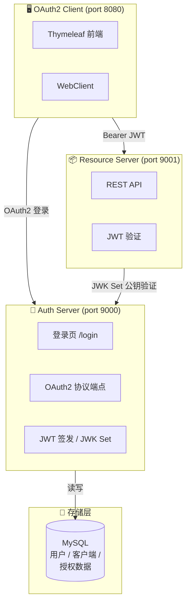
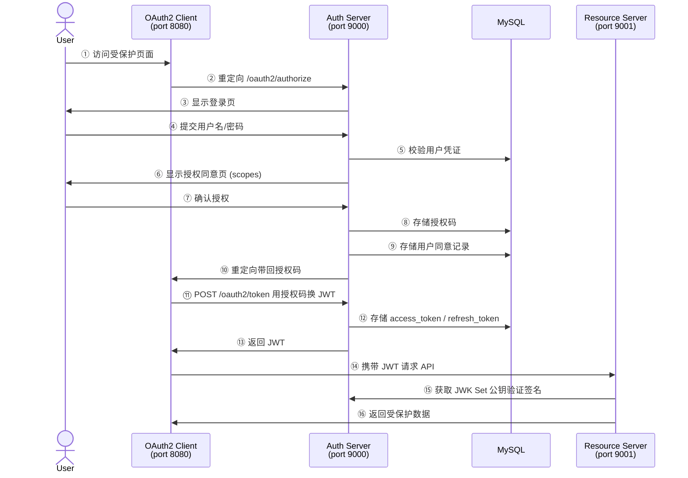

# Spring Boot 4 OAuth2 完整项目

基于 Spring Boot 4.0 + Spring Authorization Server 实现的 OAuth2/OIDC 认证授权系统。

## 架构概览



### OAuth2 授权码流程



## 技术栈

| 组件 | 技术 |
|------|------|
| 基础框架 | Spring Boot 4.0.5 |
| Java | JDK 21+ |
| 授权服务器 | spring-boot-starter-oauth2-authorization-server |
| 资源服务器 | spring-boot-starter-oauth2-resource-server |
| 客户端 | spring-boot-starter-oauth2-client |
| 数据库 | MySQL 8.0+ |
| 缓存 | Redis 7.x |
| 令牌 | JWT (RSA 签名) |
| 模板引擎 | Thymeleaf |

## 前置条件

- **JDK 21+**
- **MySQL 8.0+** (运行中)
- **Redis 7.x** (运行中)
- **Maven 3.8+**

## 快速开始

### 1. 创建 MySQL 数据库

```sql
CREATE DATABASE IF NOT EXISTS sb4_auth DEFAULT CHARACTER SET utf8mb4 COLLATE utf8mb4_unicode_ci;
```

### 2. 确认 Redis 运行

```bash
# Linux/Mac
redis-server

# Windows — 确认 Redis 服务已启动
redis-cli ping  # 应返回 PONG
```

### 3. 构建项目

```bash
cd sb4-auth
mvn clean package -DskipTests
```

### 4. 启动服务（按顺序）

**终端 1 — 启动 Auth Server**
```bash
cd auth-server
mvn spring-boot:run
```

**终端 2 — 启动 Resource Server**
```bash
cd resource-server
mvn spring-boot:run
```

**终端 3 — 启动 OAuth2 Client**
```bash
cd oauth2-client
mvn spring-boot:run
```

**终端 4 — 启动 SPA Client（任选一种方式）**

```bash
# 方式一：Python 内置 http.server
cd spa-client
python -m http.server 3000

# 方式二：Node.js npx serve
cd spa-client
npx serve -l 3000

# 方式三：Python 自定义服务器
cd spa-client
python scripts/serve.py

# 方式四：Node.js 原生服务器
cd spa-client
node scripts/serve.mjs
```

**终端 5 — 启动 SPA Vue3 Client**

```bash
cd spa-client-vue3
pnpm install
pnpm dev
```

### 5. 测试流程

#### 方式一：浏览器测试（推荐）

1. 打开 http://localhost:8080
2. 点击"登录访问受保护页面"
3. 跳转到 Auth Server 登录页 (localhost:9000/login)
4. 输入账号密码：
   - **管理员**: `admin` / `password`
   - **普通用户**: `user` / `password`
5. 登录后显示授权同意页，勾选权限并同意
6. 自动跳转回 Client 应用，展示用户信息和从 Resource Server 获取的数据

#### 方式二：SPA 客户端测试（PKCE 演示）

1. 确保已启动 SPA Client（端口 3000）
2. 打开 http://localhost:3000
3. 点击"登录"，跳转到 Auth Server 登录页
4. 输入账号密码（`admin`/`password` 或 `user`/`password`）
5. 授权同意后跳回 SPA，显示用户信息和 JWT
6. 点击"调用 Resource Server"获取受保护数据

#### 方式三：SPA Vue3 客户端测试

1. 确保已启动 SPA Vue3 Client（端口 3001）
2. 打开 http://localhost:3001
3. 点击"登录"，跳转到 Auth Server 登录页
4. 输入账号密码并授权同意
5. 自动跳转到测试页 `/profile`，显示用户信息、Token 和 API 调用

#### 方式四：curl 测试

**获取授权码 (浏览器访问)**
```
http://localhost:9000/oauth2/authorize?response_type=code&client_id=oidc-client&scope=openid%20profile%20read%20write&redirect_uri=http://127.0.0.1:8080/login/oauth2/code/my-client
```

**Client Credentials 模式获取 Token**
```bash
curl -X POST http://localhost:9000/oauth2/token \
  -H "Authorization: Basic $(echo -n 'resource-server:secret' | base64)" \
  -d "grant_type=client_credentials&scope=read write"
```

**使用 JWT 访问资源服务器**
```bash
curl http://localhost:9001/api/user/info \
  -H "Authorization: Bearer <your-access-token>"
```

**公开接口（无需 Token）**
```bash
curl http://localhost:9001/api/public/hello
```

## 模块说明

### auth-server (端口 9000)

OAuth2 授权服务器，核心功能：

- **协议端点**: `/oauth2/authorize`, `/oauth2/token`, `/oauth2/jwks`, `/oauth2/logout`
- **OIDC**: `/userinfo` 端点
- **登录页**: `/login` (Thymeleaf 渲染)
- **客户端存储**: MySQL (`oauth2_registered_client` 表)
- **授权存储**: MySQL — JDBC (`oauth2_authorization` 表)
- **同意存储**: MySQL — JDBC (`oauth2_authorization_consent` 表)
- **JWT**: RSA 2048 位签名，自定义 claims (roles)

### resource-server (端口 9001)

受保护的资源服务器：

| 端点 | 权限 | 说明 |
|------|------|------|
| `GET /api/public/hello` | 无需认证 | 公开接口 |
| `GET /api/user/info` | 已认证 | 当前用户 JWT 信息 |
| `GET /api/user/messages` | 已认证 | 用户消息 |
| `GET /api/read/data` | 已认证 | 需要 read scope |
| `GET /api/write/data` | 已认证 | 需要 write scope |
| `GET /api/admin/dashboard` | ADMIN 角色 | 管理员面板 |

### oauth2-client (端口 8080)

OAuth2 客户端应用：

- 使用 Authorization Code + PKCE 流程
- 登录后自动获取 JWT Token
- 通过 WebClient 调用 Resource Server API
- 展示用户信息、Token Claims、受保护数据
- Token Introspection（`POST /api/introspect`）：服务端用 oidc-client:secret Basic Auth 调 auth-server
- Token Revocation（`POST /api/revoke-client`）：调 auth-server `/api/revoke` 吊销 token
- API 未认证返回 401 JSON（而非 302 重定向），`exceptionHandling` + `RequestMatcher`

#### 服务端与 SPA 的 Token Revocation 区别

| 对比项 | SPA (spa-client / spa-client-vue3) | 服务端 (oauth2-client) |
|--------|-----------------------------------|----------------------|
| 吊销后本地清理 | `store.clear()` / `sessionStorage.removeItem()` | 可选移除 `OAuth2AuthorizedClientService` |
| API 请求行为 | 无 Bearer token → 401 | `@RegisteredOAuth2AuthorizedClient` 自动重新授权获取新 token |
| 不跳转时效果 | API 全部 401 | API 仍成功（自动获取新 token，展示服务端自动续期能力） |
| 勾选跳转首页 | 清除 token + 跳转 | 移除授权客户端 + 跳转，需重新登录 |

### spa-client (端口 3000)

纯前端 SPA 应用（HTML + 原生 JS），功能与 `spa-client-vue3` 完全对齐：

#### OAuth2 核心功能

- 公共客户端 (`client_id: spa-client`)，无 client_secret，认证方式为 `NONE`
- 手动实现 PKCE：生成 `code_verifier` / `code_challenge`，SHA-256 哈希
- 授权码换取令牌时携带 `code_verifier`
- 支持 `refresh_token` 续期（公共客户端已注册 `REFRESH_TOKEN` grant type）
- Silent Refresh（iframe + `prompt=none`）静默重新授权，作为 refresh_token 的 fallback
- 支持 OIDC 登出
- 调用 Resource Server 获取受保护数据（`/api/user/info`、`/api/user/messages`）

#### Token 续期

- **refresh_token 优先**：有 refresh_token 时用 `refresh_token` grant 换新 access_token
- **Silent Refresh fallback**：无 refresh_token 时 iframe 静默授权续期
- **自动续期**：过期前 60 秒自动触发续期，可手动开关
- **手动续期**：点击"手动续期"按钮立即续期

#### Token Introspection & Revocation

- **Introspection**：通过 `/oauth2/introspect`（oidc-client:secret Basic Auth）查询 token 状态
- **Revocation**：通过自定义 `/api/revoke` 端点直接操作 OAuth2AuthorizationService 吊销 token
- 吊销后可选"跳转首页"或留在当前页

#### Access Token 信息展示

- Token Type / Issued At / Expires At
- 实时倒计时（即将过期行：<60秒红色、<2分钟橙色、其余绿色）
- Scopes 标签、Refresh Token 状态（状态圆点）、自动续期状态
- access_token 浅色代码块展示

#### ID Token Claims 展示

- Issued At / Expires At
- Claims 表格：sub、preferred_username、nickname、email、phone、scp/scope、roles、iss、aud、azp、jti、sid

#### API 响应展示

- 双列布局：`/api/user/info` + `/api/user/messages`
- 多行换行显示，无横向/纵向滚动条，自适应高度
- 浅色代码块主题（#f8f9fa 背景、#212529 文字、#dee2e6 边框）

#### 重要安全说明

1. **Session 存储**：`code_verifier`、Token 等存储在 `sessionStorage`，页面关闭即清除
2. **JWT 中文解码**：使用 `TextDecoder('utf-8')` 解码 base64url，避免 `atob()` 中文乱码
3. **吊销说明**：JWT 是无状态的，吊销不会立即使 resource-server 拒绝请求，需本地清除 token

#### 启动 SPA 客户端

```bash
# 方式一：Python 自定义服务器
cd spa-client
python scripts/serve.py

# 方式二：Python 内置 http.server
cd spa-client
python -m http.server 3000
# 或
scripts/serve-py-http-server.bat   # Windows
bash scripts/serve-py-http-server.sh      # Linux/Mac

# 方式三：Node.js 原生 HTTP 服务器
cd spa-client
node scripts/serve.mjs

# 方式四：npx http-server（禁用缓存）
cd spa-client
npx http-server -p 3000 -c-1
# 或
scripts/serve-http-server.bat   # Windows
bash scripts/serve-http-server.sh  # Linux/Mac
```

访问 http://localhost:3000 测试完整 OAuth2 PKCE 流程。

### spa-client-vue3 (端口 3001)

Vue3 + Vite + Vue Router + Pinia + Axios SPA 应用，功能与 `spa-client` 完全对齐：

#### OAuth2 核心功能

- 公共客户端 (`client_id: spa-client-vue3`)，无 client_secret，认证方式为 `NONE`
- 手动实现 PKCE：生成 `code_verifier` / `code_challenge`，SHA-256 哈希
- 授权码换取令牌时携带 `code_verifier`
- 支持 `refresh_token` 续期（公共客户端已注册 `REFRESH_TOKEN` grant type + `reuseRefreshTokens(false)`）
- Silent Refresh（iframe + `prompt=none`）静默重新授权，作为 refresh_token 的 fallback
- Vue Router 导航守卫：未认证访问受保护页自动跳登录，已认证访问首页跳测试页
- API 401 拦截器：Token 无效或过期自动清除 Pinia store
- 支持 OIDC 登出
- 调用 Resource Server 获取受保护数据（`/api/user/info`、`/api/user/messages`）

#### Token 续期

- **refresh_token 优先**：有 refresh_token 时用 `refresh_token` grant 换新 access_token
- **Silent Refresh fallback**：无 refresh_token 时 iframe 静默授权续期
- **自动续期**：过期前 60 秒自动触发续期，可手动开关
- **手动续期**：点击"手动续期"按钮立即续期
- **5 秒冷却**：防止自动续期重复触发

#### Token Introspection & Revocation

- **Introspection**：通过 `/oauth2/introspect`（oidc-client:secret Basic Auth）查询 token 状态
- **Revocation**：通过自定义 `/api/revoke` 端点直接操作 OAuth2AuthorizationService 吊销 token
- 吊销后可选"跳转首页"或留在当前页
- 吊销前停止倒计时和自动续期定时器，防止 `store.clear()` 触发自动跳转

#### Access Token 信息展示

- Token Type / Issued At / Expires At
- 实时倒计时（即将过期行：<60秒红色、<2分钟橙色、其余绿色）
- Scopes 标签（兼容 `scp` 和 `scope` 字段名）、Refresh Token 状态（状态圆点）、自动续期状态
- access_token 浅色代码块展示

#### ID Token Claims 展示

- Issued At / Expires At
- Claims 表格：sub、preferred_username、nickname、email、phone、scp/scope、roles、iss、aud、azp、jti、sid

#### API 响应展示

- 双列布局：`/api/user/info` + `/api/user/messages`
- 多行换行显示，无横向/纵向滚动条，自适应高度
- 浅色代码块主题（#f8f9fa 背景、#212529 文字、#dee2e6 边框）

#### 技术栈

| 技术 | 用途 |
|------|------|
| Vue 3 | 响应式框架 |
| Vue Router | 路由 + 导航守卫 |
| Pinia | 状态管理（token/claims/expiresAt/scopes） |
| Axios | HTTP 客户端（authServerClient + resourceServerClient + 401 拦截器） |
| Vite | 构建工具 |
| vite-plugin-pwa | PWA 支持（workbox 预缓存） |

#### 重要安全说明

1. **Pinia computed 缓存问题**：`store.remaining` 是 computed，依赖 `Date.now()` 非响应式，Vue 缓存导致 setInterval 中值不更新，改为直接 `store.expiresAtMs - Date.now()` 计算
2. **循环依赖**：`stores/oauth2.js` ↔ `utils/oauth2.js` 导致模块未初始化，拆出 `crypto.js` 纯工具函数解决
3. **JWT 中文解码**：使用 `TextDecoder('utf-8')` 解码 base64url，避免 `atob()` 中文乱码
4. **吊销说明**：JWT 是无状态的，吊销不会立即使 resource-server 拒绝请求，需本地清除 token

#### 页面路由

| 路由 | 说明 | 权限 |
|------|------|------|
| `/` | 登录入口 + PKCE 流程说明 | 公开 |
| `/callback` | OAuth2 授权回调（一次性，自动跳转） | 公开 |
| `/profile` | 测试页（Token 信息、API 调用、Introspection、Revocation、登出） | 需认证 |

#### 启动 SPA Vue3 客户端

```bash
cd spa-client-vue3
pnpm install
pnpm dev
```

访问 http://localhost:3001

## PKCE（Proof Key for Code Exchange）

PKCE 是 OAuth 2.0 授权码流程的安全增强机制，已在 `oidc-client` 上通过 `requireProofKey(true)` 启用。

### PKCE 作用

| 作用 | 说明 |
|------|------|
| **防止授权码拦截攻击** | 攻击者即使截获授权码，没有 `code_verifier` 也无法换取令牌 |
| **替代 client_secret** | 公共客户端（SPA、移动 App）无法安全存储密钥，PKCE 提供等效安全保障 |
| **绑定授权请求与令牌请求** | `code_challenge` 和 `code_verifier` 的哈希关系确保只有发起授权的客户端才能完成令牌交换 |

### PKCE 工作流程

1. 客户端生成随机 `code_verifier`，计算 `code_challenge = SHA256(code_verifier)`
2. 授权请求携带 `code_challenge` + `code_challenge_method=S256`，授权服务器缓存
3. 换取令牌时客户端发送原始 `code_verifier`，服务器验证哈希是否匹配
4. 授权码被截获也无法使用（攻击者没有 `code_verifier`）

### 本项目 PKCE 配置

在 `auth-server/.../SecurityConfig.java` 中：

```java
.clientSettings(ClientSettings.builder()
    .requireAuthorizationConsent(false)
    .requireProofKey(true)    // PKCE 强制启用
    .build())
```

> **注意**：当 `requireProofKey(true)` 时，使用授权码流程的客户端**必须**提供 PKCE 参数，否则授权服务器拒绝请求。Spring Security 的 `oauth2Login()` 会自动处理 PKCE，SPA 需要手动实现。

## Token 自动续期

用于**用户长期在线的应用**，避免因 access_token 过期强制重新登录。

| 机制 | 适用客户端 | 原理 |
|------|-----------|------|
| **refresh_token** | 机密客户端 + 公共客户端（需注册 REFRESH_TOKEN grant type） | 用 refresh_token 换新 access_token，无需用户交互 |
| **Silent Refresh** | 公共客户端（SPA，作为 refresh_token 的 fallback） | 隐藏 iframe + `prompt=none` 静默重新授权 |

### 演示场景

#### oauth2-client（端口 8080）— refresh_token 自动续期

最标准的场景。Spring Security 的 `OAuth2AuthorizedClientManager` **已内置支持**：当 access_token 过期时，自动用 refresh_token 获取新 token，用户无感知。

```
access_token 过期 → OAuth2AuthorizedClientManager 自动检测
  → 使用 refresh_token 调用 /oauth2/token
  → 获取新 access_token
  → 请求继续，用户无感知
```

#### spa-client / spa-client-vue3 — refresh_token 优先 + Silent Refresh fallback

公共客户端已注册 `REFRESH_TOKEN` grant type + `reuseRefreshTokens(false)`，可获得 refresh_token：

```
access_token 过期 → 定时检测 remaining < 60s
  → 有 refresh_token → 调用 /oauth2/token (grant_type=refresh_token)
  → 无 refresh_token → iframe 加载 /oauth2/authorize?prompt=none
    → 用户已登录 → 自动签发新授权码 → exchangeCode() 获取新 access_token
    → 用户未登录 → 显示登录页（需完整登录流程）
  → 续期成功，用户无感知
```

> **注意**：Silent Refresh 需要用户在授权服务器仍有有效 session，否则 iframe 会显示登录页。

## MFA (TOTP) 两步验证

基于 Google Authenticator 的 TOTP（Time-based One-Time Password）两步验证实现。

### 技术实现

| 组件 | 技术/库 |
|------|---------|
| TOTP 生成/验证 | `com.warrenstrange:googleauth:1.5.0` |
| QR 码生成 | `com.google.zxing:core:3.5.1` + `javase:3.5.1` |
| 用户模型扩展 | User 实体添加 `totpSecret`、`totpEnabled` 字段 |
| MFA Filter | `MfaAuthenticationFilter` 拦截未验证 session |
| QR 码 CSP | `img-src 'self' data:;` 允许 base64 图片 |

### 新增文件

- `MfaService.java` - TOTP secret 生成、QR 码生成、验证码校验
- `MfaController.java` - `/mfa/setup`、`/mfa/verify`、`/mfa/enable`、`/mfa/disable` 端点
- `MfaAuthenticationFilter.java` - 登录后拦截未 MFA 验证的 session
- `mfa-setup.html` - MFA 设置页面（显示 QR 码）
- `mfa-verify.html` - MFA 验证页面（登录后输入验证码）
- `mfa.css` - MFA 页面样式

### 修改文件

- `auth-server/pom.xml` - 添加 googleauth + zxing 依赖
- `User.java` - 添加 `totpSecret`、`totpEnabled` 字段
- `schema.sql` - 添加 `totp_secret`、`totp_enabled` 列
- `SecurityConfig.java` - `/mfa/**` 路径 permitAll，CSP 添加 `img-src 'self' data:;`
- `jwtTokenCustomizer()` - JWT claims 添加 `mfa_enabled` 字段

### 使用流程

#### 1. 启用 MFA

1. 登录后访问 `http://localhost:9000/mfa/setup`
2. 使用 Google Authenticator 扫描 QR 码
3. 输入 6 位验证码完成绑定
4. JWT token 的 claims 会包含 `mfa_enabled: true`

#### 2. 登录流程（启用 MFA 后）

1. 访问客户端应用，跳转到 Auth Server 登录页
2. 输入用户名和密码
3. 自动跳转到 `/mfa/verify`（MFA 验证页）
4. 打开 Google Authenticator，输入显示的 6 位验证码
5. 验证成功后继续 OAuth2 授权流程
6. 完成登录，获取 access_token

#### 3. 管理 MFA

- 访问 `http://localhost:9000/mfa/setup` 可查看 MFA 状态
- 已启用时显示绿色指示器，可点击"禁用 MFA"
- 禁用后下次登录不再需要两步验证

#### 4. spa-client-vue3 MFA 集成

ProfileView 页面新增 **MFA (两步验证)** 卡片：

- 显示 MFA 启用状态（绿色/灰色指示器）
- ID Token claims 显示 `mfa_enabled` 字段
- 提供"启用 MFA"/"管理 MFA 设置"按钮
- 点击按钮新窗口打开 `http://localhost:9000/mfa/setup`

**使用步骤：**

1. 登录 spa-client-vue3 (`http://localhost:3001`)
2. 进入 Profile 页面，查看 "MFA (两步验证)" 卡片
3. 点击 "🔐 启用 MFA" 按钮
4. 新窗口打开 Auth Server MFA 设置页
5. 扫描 QR 码并输入验证码完成绑定
6. 退出登录后重新登录，验证 MFA 流程
7. 登录成功后 Profile 页面显示 "已启用 (TOTP)"

### 安全说明

1. **Session 属性**：`MFA_VERIFIED` 标记当前 session 已通过 MFA 验证
2. **白名单路径**：`/mfa/verify`、`/mfa/setup`、`/login`、`/logout`、`/css/**`、`/js/**` 不拦截
3. **TOTP Secret 存储**：存储在 MySQL `sys_user.totp_secret` 字段（生产环境应加密存储）
4. **QR 码 CSP**：需要 `img-src 'self' data:;` 允许 base64 格式的 QR 码图片

## 预置客户端

| Client ID | Secret | 认证方式 | 授权类型 | 说明 |
|-----------|--------|----------|----------|------|
| `oidc-client` | `secret` | CLIENT_SECRET_BASIC | authorization_code, refresh_token | Web 客户端 (PKCE) |
| `spa-client` | 无 (公共客户端) | NONE | authorization_code, refresh_token | SPA 客户端 (PKCE 必须) |
| `spa-client-vue3` | 无 (公共客户端) | NONE | authorization_code, refresh_token | SPA Vue3 客户端 (PKCE 必须) |
| `resource-server` | `secret` | CLIENT_SECRET_BASIC | client_credentials | 服务间调用 |

## 预置用户

| 用户名 | 密码 | 角色 |
|--------|------|------|
| `admin` | `password` | ROLE_ADMIN, ROLE_USER |
| `user` | `password` | ROLE_USER |

## MySQL 数据库配置

修改 `auth-server/src/main/resources/application.yml`:

```yaml
spring:
  datasource:
    url: jdbc:mysql://localhost:3306/sb4_auth?useUnicode=true&characterEncoding=utf-8&useSSL=false&serverTimezone=Asia/Shanghai&allowPublicKeyRetrieval=true
    username: root
    password: fairy-vip
```

## 常见问题

### Q: 启动报错 "RSA key pair" 相关？
A: 授权服务器每次启动会生成新的 RSA 密钥对，旧 Token 会失效，这是正常行为。生产环境应从文件加载固定密钥。

### Q: Client 启动后跳转 Auth Server 报错？
A: 确保三个服务按顺序启动：Auth Server → Resource Server → Client。

### Q: Redis 连接失败？
A: 确认 Redis 服务已启动，默认无需密码。如果 Redis 设置了密码，修改 `application.yml` 中 `spring.data.redis.password`。
