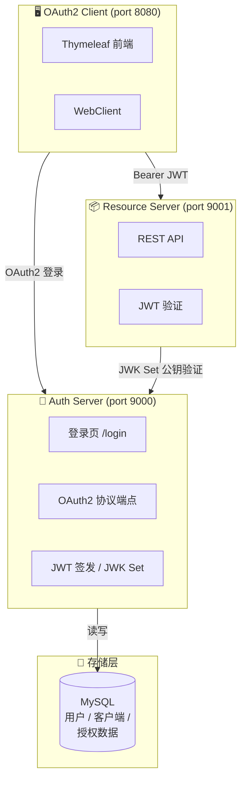
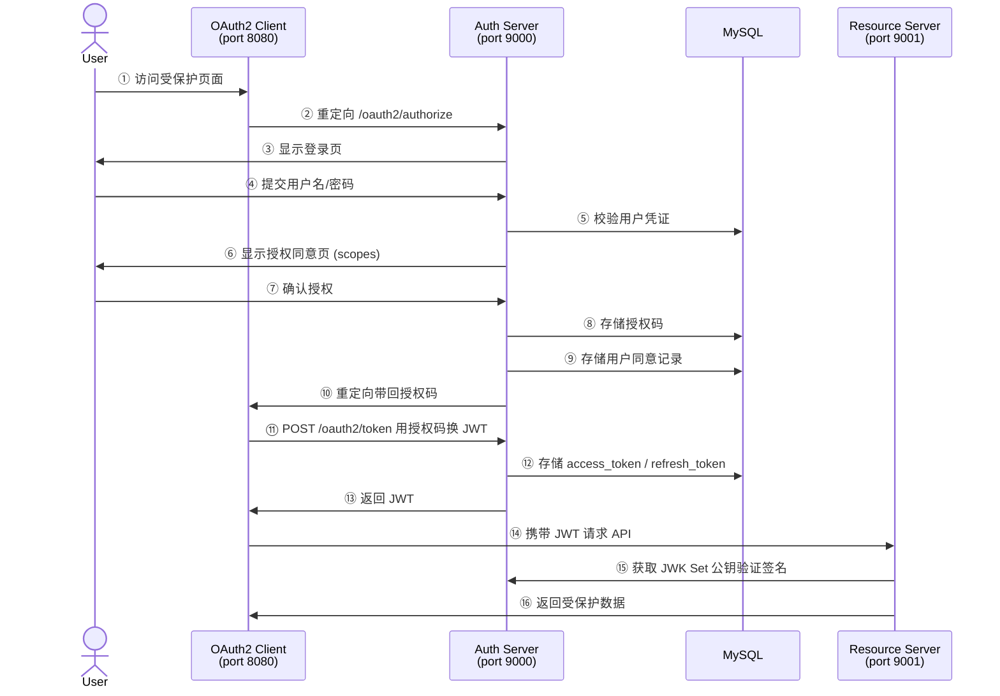

# Spring Boot 4 OAuth2 完整项目

基于 Spring Boot 4.0 + Spring Authorization Server 实现的 OAuth2/OIDC 认证授权系统。

## 架构概览



### OAuth2 授权码流程



## 技术栈

| 组件 | 技术 |
|------|------|
| 基础框架 | Spring Boot 4.0.5 |
| Java | JDK 21+ |
| 授权服务器 | spring-boot-starter-oauth2-authorization-server |
| 资源服务器 | spring-boot-starter-oauth2-resource-server |
| 客户端 | spring-boot-starter-oauth2-client |
| 数据库 | MySQL 8.0+ |
| 缓存 | Redis 7.x |
| 令牌 | JWT (RSA 签名) |
| 模板引擎 | Thymeleaf |

## 前置条件

- **JDK 21+**
- **MySQL 8.0+** (运行中)
- **Redis 7.x** (运行中)
- **Maven 3.8+**

## 快速开始

### 1. 创建 MySQL 数据库

```sql
CREATE DATABASE IF NOT EXISTS sb4_auth DEFAULT CHARACTER SET utf8mb4 COLLATE utf8mb4_unicode_ci;
```

### 2. 确认 Redis 运行

```bash
# Linux/Mac
redis-server

# Windows — 确认 Redis 服务已启动
redis-cli ping  # 应返回 PONG
```

### 3. 构建项目

```bash
cd sb4-auth
mvn clean package -DskipTests
```

### 4. 启动服务（按顺序）

**终端 1 — 启动 Auth Server**
```bash
cd auth-server
mvn spring-boot:run
```

**终端 2 — 启动 Resource Server**
```bash
cd resource-server
mvn spring-boot:run
```

**终端 3 — 启动 OAuth2 Client**
```bash
cd oauth2-client
mvn spring-boot:run
```

### 5. 测试流程

#### 方式一：浏览器测试（推荐）

1. 打开 http://localhost:8080
2. 点击"登录访问受保护页面"
3. 跳转到 Auth Server 登录页 (localhost:9000/login)
4. 输入账号密码：
   - **管理员**: `admin` / `password`
   - **普通用户**: `user` / `password`
5. 登录后显示授权同意页，勾选权限并同意
6. 自动跳转回 Client 应用，展示用户信息和从 Resource Server 获取的数据

#### 方式二：curl 测试

**获取授权码 (浏览器访问)**
```
http://localhost:9000/oauth2/authorize?response_type=code&client_id=oidc-client&scope=openid%20profile%20read%20write&redirect_uri=http://127.0.0.1:8080/login/oauth2/code/my-client
```

**Client Credentials 模式获取 Token**
```bash
curl -X POST http://localhost:9000/oauth2/token \
  -H "Authorization: Basic $(echo -n 'resource-server:secret' | base64)" \
  -d "grant_type=client_credentials&scope=read write"
```

**使用 JWT 访问资源服务器**
```bash
curl http://localhost:9001/api/user/info \
  -H "Authorization: Bearer <your-access-token>"
```

**公开接口（无需 Token）**
```bash
curl http://localhost:9001/api/public/hello
```

## 模块说明

### auth-server (端口 9000)

OAuth2 授权服务器，核心功能：

- **协议端点**: `/oauth2/authorize`, `/oauth2/token`, `/oauth2/jwks`, `/oauth2/logout`
- **OIDC**: `/userinfo` 端点
- **登录页**: `/login` (Thymeleaf 渲染)
- **客户端存储**: MySQL (`oauth2_registered_client` 表)
- **授权存储**: MySQL — JDBC (`oauth2_authorization` 表)
- **同意存储**: MySQL — JDBC (`oauth2_authorization_consent` 表)
- **JWT**: RSA 2048 位签名，自定义 claims (roles)

### resource-server (端口 9001)

受保护的资源服务器：

| 端点 | 权限 | 说明 |
|------|------|------|
| `GET /api/public/hello` | 无需认证 | 公开接口 |
| `GET /api/user/info` | 已认证 | 当前用户 JWT 信息 |
| `GET /api/user/messages` | 已认证 | 用户消息 |
| `GET /api/read/data` | 已认证 | 需要 read scope |
| `GET /api/write/data` | 已认证 | 需要 write scope |
| `GET /api/admin/dashboard` | ADMIN 角色 | 管理员面板 |

### oauth2-client (端口 8080)

OAuth2 客户端应用：

- 使用 Authorization Code + PKCE 流程
- 登录后自动获取 JWT Token
- 通过 WebClient 调用 Resource Server API
- 展示用户信息、Token Claims、受保护数据

## 预置客户端

| Client ID | Secret | 授权类型 | 说明 |
|-----------|--------|----------|------|
| `oidc-client` | `secret` | authorization_code, refresh_token | Web 客户端 (PKCE) |
| `resource-server` | `secret` | client_credentials | 服务间调用 |

## 预置用户

| 用户名 | 密码 | 角色 |
|--------|------|------|
| `admin` | `password` | ROLE_ADMIN, ROLE_USER |
| `user` | `password` | ROLE_USER |

## MySQL 数据库配置

修改 `auth-server/src/main/resources/application.yml`:

```yaml
spring:
  datasource:
    url: jdbc:mysql://localhost:3306/sb4_auth?useUnicode=true&characterEncoding=utf-8&useSSL=false&serverTimezone=Asia/Shanghai&allowPublicKeyRetrieval=true
    username: root
    password: fairy-vip
```

## 常见问题

### Q: 启动报错 "RSA key pair" 相关？
A: 授权服务器每次启动会生成新的 RSA 密钥对，旧 Token 会失效，这是正常行为。生产环境应从文件加载固定密钥。

### Q: Client 启动后跳转 Auth Server 报错？
A: 确保三个服务按顺序启动：Auth Server → Resource Server → Client。

### Q: Redis 连接失败？
A: 确认 Redis 服务已启动，默认无需密码。如果 Redis 设置了密码，修改 `application.yml` 中 `spring.data.redis.password`。
